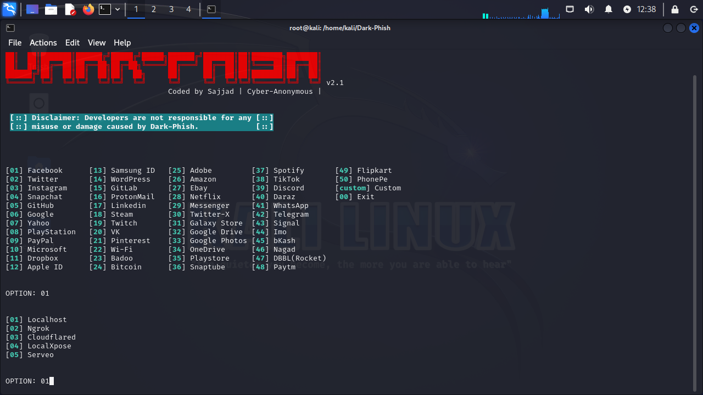

## Resultado do meu desfio de projeto de phishing da dio

### OBS : A explicação foi feita utilizando o setoolkit mas não consegui fazelo funcionar de jeito nenhum então utilizei o Dark-Phish

# Ferramentas:

 - Kali Linux
 - [Dark-Phish](https://github.com/Cyber-Anonymous/Dark-Phish)

### Utilizando dark-phish para Phishing no Kali Linux

- Depois de clonar o dark phish entre na pasta ```cd /dark-phish/```
- inicie o darkphish ```python3 dark-phish.py```
- Escolha o site (utilizei o facebook igual no setoolkit) ``` 01 ```

    
  
- Depois localhost ``` 01 ```

    
  
- Ele ira dar o link que no caso é o iplocal igual no setoolkit
  
- Por fim quando acessado teremos o site clone do facebook igual no setoolkit
  
    

# Resultados:


